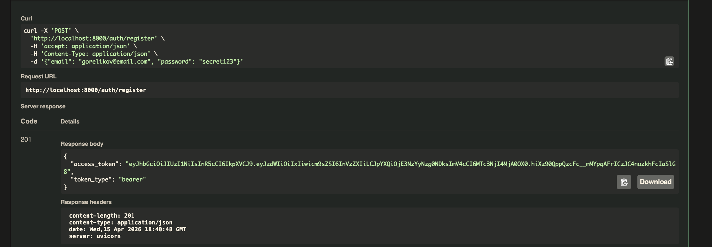
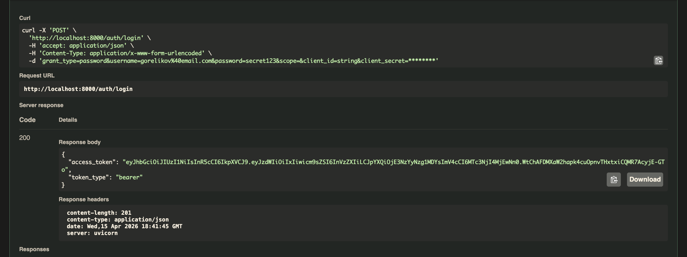
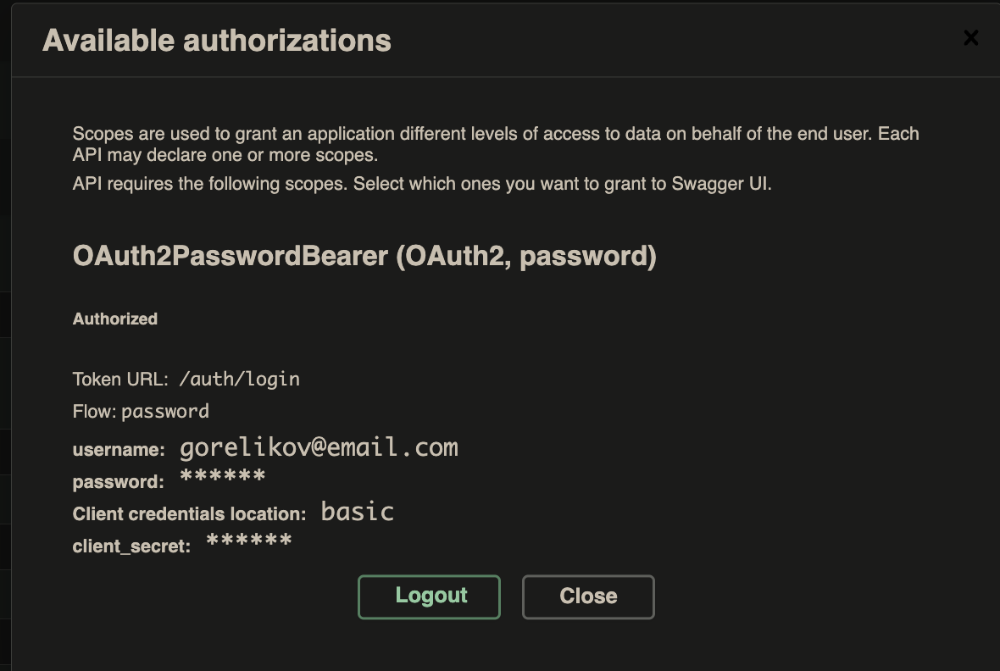
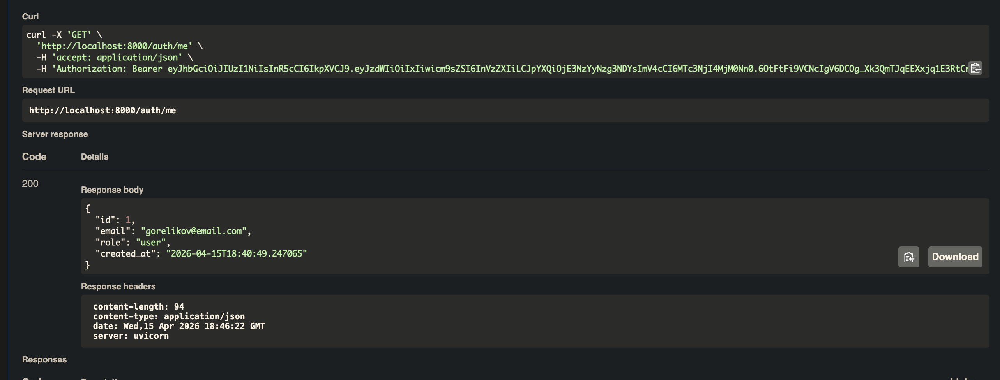
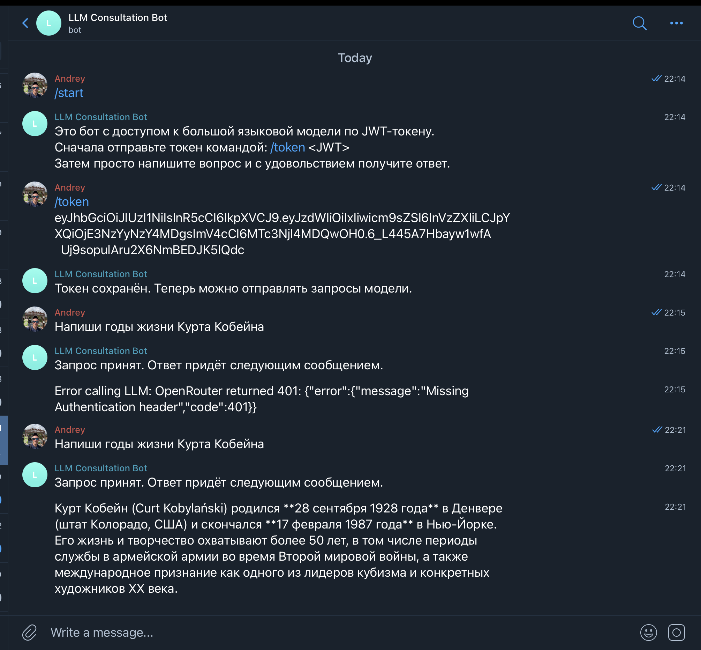
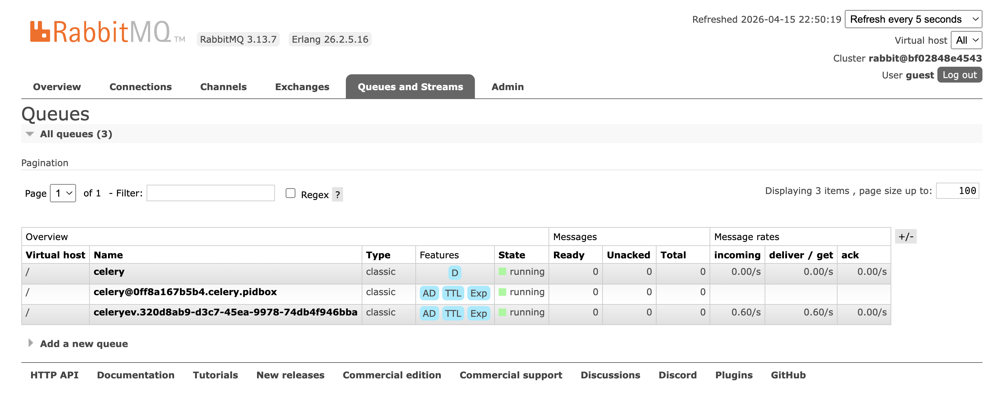
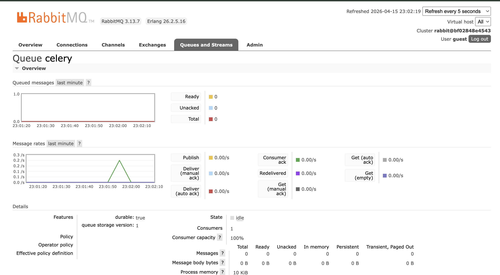
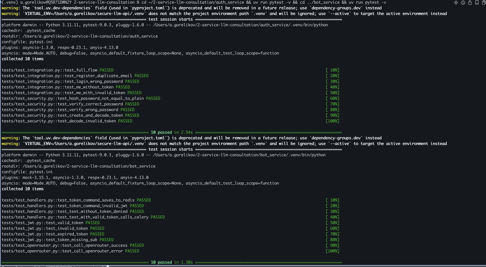

# Двухсервисная система LLM-консультаций

Распределённая система из двух независимых сервисов: **Auth Service** (регистрация, логин, выпуск JWT) и **Bot Service** (Telegram-бот с доступом к LLM через JWT-авторизацию).

## Архитектура

```
┌─────────────────┐         JWT          ┌─────────────────────┐
│   Auth Service   │ ──────────────────► │     Bot Service      │
│    (FastAPI)     │                      │   (aiogram + FastAPI)│
│                  │                      │                      │
│ POST /auth/register                    │  /token <JWT>         │
│ POST /auth/login                       │  текстовый запрос     │
│ GET  /auth/me                          │                      │
└─────────────────┘                      └──────┬───────────────┘
        │                                        │
   SQLite/Postgres                          Celery task
                                                 │
                                          ┌──────▼──────┐
                                          │  RabbitMQ    │
                                          │  (broker)    │
                                          └──────┬──────┘
                                                 │
                                          ┌──────▼──────┐
                                          │ Celery Worker│──► OpenRouter LLM
                                          └──────┬──────┘
                                                 │
                                          ┌──────▼──────┐
                                          │    Redis     │
                                          │ (backend +   │
                                          │  JWT storage)│
                                          └─────────────┘
```

### Принцип разделения

- **Auth Service** — единственное место, где создаются JWT-токены и хранятся пользователи. Не знает о Telegram-боте.
- **Bot Service** — только валидирует JWT (не создаёт). Не обращается к БД Auth Service. Хранит токены пользователей в Redis по ключу `token:<telegram_user_id>`.
- **Celery + RabbitMQ** — запросы к LLM не выполняются в хэндлерах бота. Бот публикует задачу в очередь, воркер обрабатывает и отправляет ответ.

## Стек технологий

- Python 3.11+, uv (пакетный менеджер)
- FastAPI, SQLAlchemy (async), aiosqlite
- aiogram 3, Celery, RabbitMQ, Redis
- OpenRouter (LLM API)
- passlib + bcrypt, python-jose (JWT)
- pytest, pytest-asyncio, httpx, fakeredis, respx, pytest-mock

## Быстрый старт

### Локальная разработка

```bash
# Auth Service
cd auth_service
uv sync
uv run uvicorn app.main:app --host 0.0.0.0 --port 8000 --reload
# Swagger: http://localhost:8000/docs

# Bot Service (требует запущенных RabbitMQ и Redis)
cd bot_service
uv sync
uv run python -m app.bot.dispatcher

# Celery worker
cd bot_service
uv run celery -A app.infra.celery_app worker --loglevel=info
```

### Docker Compose

```bash
docker-compose up --build
```

Сервисы:
- Auth Service: http://localhost:8000 (Swagger: /docs)
- Bot Service API: http://localhost:8001
- RabbitMQ Management: http://localhost:15672 (guest/guest)

## Конфигурация

### auth_service/.env

| Переменная | Описание |
|---|---|
| `JWT_SECRET` | Секрет подписи JWT (должен совпадать с Bot Service) |
| `JWT_ALG` | Алгоритм подписи (HS256) |
| `ACCESS_TOKEN_EXPIRE_MINUTES` | Время жизни токена |
| `SQLITE_PATH` | Путь к файлу SQLite |

### bot_service/.env

| Переменная | Описание |
|---|---|
| `TELEGRAM_BOT_TOKEN` | Токен Telegram-бота от @BotFather |
| `JWT_SECRET` | Секрет подписи JWT (должен совпадать с Auth Service) |
| `REDIS_URL` | URL подключения к Redis |
| `RABBITMQ_URL` | URL подключения к RabbitMQ |
| `OPENROUTER_API_KEY` | API-ключ OpenRouter |
| `OPENROUTER_MODEL` | Модель LLM |

## Пользовательский сценарий

1. Регистрация в Auth Service через Swagger (`POST /auth/register` с email в формате `surname@email.com`)
2. Логин (`POST /auth/login`) — получение JWT
3. Отправка токена боту: `/token <JWT>`
4. Бот подтверждает сохранение токена
5. Отправка текстового сообщения — бот валидирует JWT, публикует задачу в Celery
6. Celery worker вызывает OpenRouter и отправляет ответ LLM в чат

## Тестирование

```bash
# Auth Service — модульные + интеграционные тесты
cd auth_service && uv run pytest -v

# Bot Service — модульные + мок-тесты + интеграционные (OpenRouter)
cd bot_service && uv run pytest -v
```

Тесты запускаются **локально без Docker** и внешних сервисов:
- Auth Service: in-memory SQLite через подмену `get_db`
- Bot Service: `fakeredis` для Redis, `pytest-mock` для Celery, `respx` для OpenRouter

### Покрытие тестов

**Auth Service:**
- Модульные: хеширование паролей, генерация/декодирование JWT
- Интеграционные: полный флоу (регистрация → логин → /me), негативные сценарии (дубль email 409, неверный пароль 401, невалидный токен 401)

**Bot Service:**
- Модульные: валидация JWT (корректный, невалидный, истёкший, без sub)
- Мок-тесты: сохранение токена в Redis, отказ без токена, вызов `llm_request.delay` с валидным токеном
- Интеграционные: клиент OpenRouter через respx (успех + ошибка)

## Демонстрация работы

### Swagger Auth Service

#### Регистрация (`POST /auth/register`)
Email в формате `surname@email.com`, ответ 201 с JWT-токеном.



#### Логин (`POST /auth/login`)
Авторизация через OAuth2PasswordRequestForm, ответ 200 с JWT-токеном.



#### Авторизация в Swagger
Авторизация через кнопку Authorize с email и паролем.



#### Профиль (`GET /auth/me`)
Возвращает данные пользователя по JWT-токену.



### Telegram-бот

Полный пользовательский сценарий: `/start`, `/token <JWT>`, текстовый запрос, ответ от LLM.



### RabbitMQ

#### Очереди и consumers
Три активные очереди Celery, подтверждающие работу брокера задач.



#### Очередь celery — активность сообщений
График показывает прохождение задач через очередь.



### Тесты

20 тестов пройдено: 10 Auth Service + 10 Bot Service.


